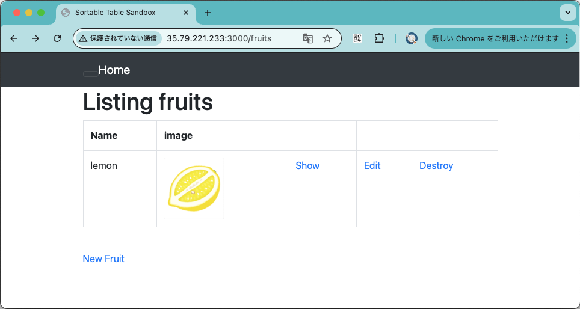
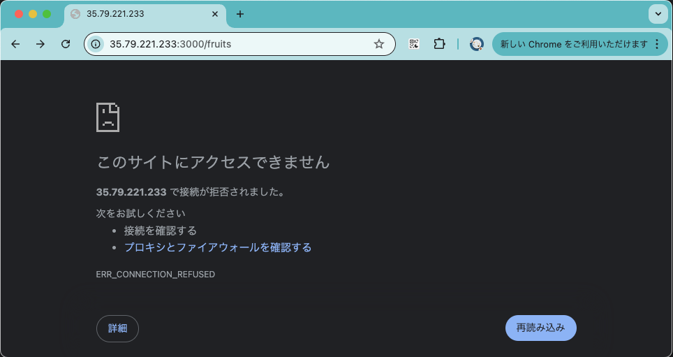
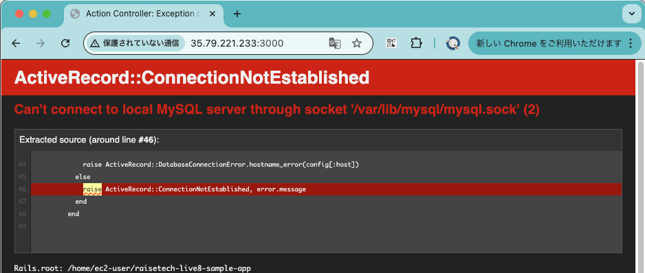

# AWSフルコース第3回
## 課題内容
### 1.サンプルアプリケーションのデプロイおよびWEBブラウザでの接続確認  
EC2インスタンスに、提供されているサンプルアプリケーションをデプロイし、Webブラウザにて接続確認を行う。
### 2.APサーバーに関する調査
1でデプロイしたサンプルアプリケーションで使われているAPサーバーの名前とバージョンを確認する。  
また、APサーバーを終了した場合、再起動した場合の動作をそれぞれ確認する。

### 3.DBサーバーに関する調査  
1でデプロイしたサンプルアプリケーションで使われているDBサーバー(エンジン)の名前とバージョンを確認する。  
また、DBサーバー(エンジン)を終了した場合の動作を確認する。

### 4.Railsの構成管理ツールに関する調査
サンプルアプリケーションで使われているRailsの構成管理ツールについて調査する。

## 1.サンプルアプリケーションのデプロイおよびWEBブラウザでの接続確認  
### 1-1.デプロイ
以下の作業を実施しました。(講義動画のデモに従って作業)
- GitHubからサンプルアプリケーションをEC2インスタンスにクローン
- **DBエンジン** のインストール、起動
- **bin/setup** による環境構築
- **bin/dev**による開発環境の起動
### 1-2.Webブラウザでの接続確認
EC2インスタンスのパブリックIPアドレス:3000で、ブラウザにて接続  


## 2.APサーバーに関する調査
### 2-1.アプリケーションで使用しているAPサーバーおよびバージョンの確認
開発環境起動時のコンソール画面で確認  
```
$ bin/dev &
[1] 18140
$ 14:50:29 web.1  | started with pid 18149
14:50:29 js.1   | started with pid 18150
14:50:29 js.1   | yarn run v1.22.22
14:50:29 js.1   | $ webpack --config ./config/webpack/webpack.config.js --watch
14:50:30 web.1  | => Booting Puma
14:50:30 web.1  | => Rails 7.1.3.2 application starting in development
14:50:30 web.1  | => Run `bin/rails server --help` for more startup options
14:50:30 js.1   | Browserslist: caniuse-lite is outdated. Please run:
14:50:30 js.1   |   npx update-browserslist-db@latest
14:50:30 js.1   |   Why you should do it regularly: https://github.com/browserslist/update-db#readme
14:50:30 web.1  | Puma starting in single mode...
14:50:30 web.1  | * Puma version: 6.6.0 ("Return to Forever")
14:50:30 web.1  | * Ruby version: ruby 3.2.3 (2024-01-18 revision 52bb2ac0a6) [x86_64-linux]
14:50:30 web.1  | *  Min threads: 514:50:30 web.1  | *  Max threads: 5
14:50:30 web.1  | *  Environment: development
14:50:30 web.1  | *          PID: 18149
14:50:30 web.1  | * Listening on http://0.0.0.0:3000
14:50:30 web.1  | Use Ctrl-C to stop
```
### → **Puma 6.6.0**
### 2-2.APサーバー終了時の動作
Pumaのプロセスを確認し、killコマンドで終了
```
$ ps aux | grep puma
ec2-user 18149  0.3 12.0 979200 117220 pts/0   Sl   14:50   0:01 puma 6.6.0 (tcp://0.0.0.0:3000) [raisetech-live8-sample-app]
ec2-user 20316  0.0  0.0 119420   920 pts/0    S+   14:56   0:00 grep puma
$ kill 18149
14:56:17 web.1  | - Gracefully stopping, waiting for requests to finish
14:56:17 web.1  | Exiting
$ 14:56:17 web.1  | terminated by SIGTERM
14:56:17 system | sending SIGTERM to all processes
14:56:17 js.1   | exited with code 1
[1]+  Exit 1                  bin/dev
```
### 結果
アプリケーションへの接続ができなくなった。  

### 2-3.APサーバー再起動時の動作
2-1と同様にbin/devによって、APサーバーの再起動を実施したところ、アプリケーションへの接続が再度可能になった。

## 3.DBサーバーに関する調査
### 3-1.アプリケーションで使用しているDBサーバー(エンジン)およびバージョンの確認
Railsアプリケーションにおけるデータベースの設定ファイル(config/database.yml)の内容を確認
```
$ cat config/database.yml
default: &default
  adapter: mysql2
  encoding: utf8mb4
  pool: <%= ENV.fetch("RAILS_MAX_THREADS") { 5 } %>
  username: root
  password: d5BVsPEn12345_
development:
  <<: *default
  database: raisetech_live8_sample_app_development
  socket: /var/lib/mysql/mysql.sock
〜以下略〜
```
→ adapter: mysql2であることから、**MySQL**を使用している。  

バージョンについては、バージョン確認コマンドで確認
```
$ mysql --version
mysql  Ver 14.14 Distrib 5.7.44, for Linux (x86_64) using  EditLine wrapper
```
### → **MySQL 5.7.44**
### 3-2.DBサーバー終了時の動作
systemctlコマンドでMySQLを終了
```
$ sudo systemctl stop mysqld
```
### 結果
「Can't connect to local MySQL server」と表示され、アプリケーションへの接続ができなくなった。


## 4.Railsの構成管理ツールに関する調査
Railsのアプリケーションでは、構成管理ツールとしてBundlerを使用している。  
`bundle install`と実行することで、Gemfileに記載したバージョンのライブラリをインストールすることができる。
#### サンプルアプリケーションのGemfile
```
$ cat Gemfile
source 'https://rubygems.org'
git_source(:github) { |repo| "https://github.com/#{repo}.git" }

ruby '3.2.3'

# Bundle edge Rails instead: gem 'rails', github: 'rails/rails'
gem 'rails', '7.1.3.2'
# Use mysql as the database for Active Record
gem 'mysql2', '~> 0.5'
gem 'puma'
gem 'sass-rails', '>= 6'
gem 'turbolinks', '~> 5'
gem 'jbuilder', '~> 2.7'
gem 'bootsnap', '>= 1.4.4', require: false
〜以下略〜
```
↑ 実際にサーバーに関連している`puma`や`mysql2`が記載されていることが確認できる。

## 所感
チーム開発で使用するGitにおける、以下の理解が深まりました。
- **Webアプリケーションを構成する要素(APサーバー、DBサーバー)**
- **Linuxコマンドでの操作について**

また、サンプルアプリケーションのデプロイ時に発生したエラーを解決していく中で、エラーログの読み取り能力やRailsアプリケーションの構成に関する理解が深まりました。  
特に、エラー解消においては、「とりあえず再起動！」といった対処ではなく、原因を正しく特定し、適切に解決することを意識できたのが良かったです。  
今後の課題でも、この姿勢を大切にして取り組んでいきたいと思います。
