# AWSフルコース第4回
## 課題内容
AWSにて、EC2とRDSの作成を行う。また、EC2からRDSへの疎通確認を行う。
### 1.VPC、サブネットの作成
EC2、RDSを作成する前提となるVPC、サブネットおよび関連するネットワークリソースを作成する。
- VPC
- インターネットゲートウェイ
- サブネット
- ルートテーブル
- ネットワークACL
### 2.EC2の作成
EC2を作成する。
- EC2
- セキュリティグループ
### 3.RDSの作成
RDSを作成する。
- RDS
- サブネットグループ
- セキュリティグループ
### 4.EC2からRDSへの疎通確認
2で作成したEC2から、3で作成したRDSへの疎通確認を行うことで、各サービスの作成が正常に行われていることを確認する。

## 1.VPC、サブネットの作成
2AZの構成で作成
### 1-1.VPC
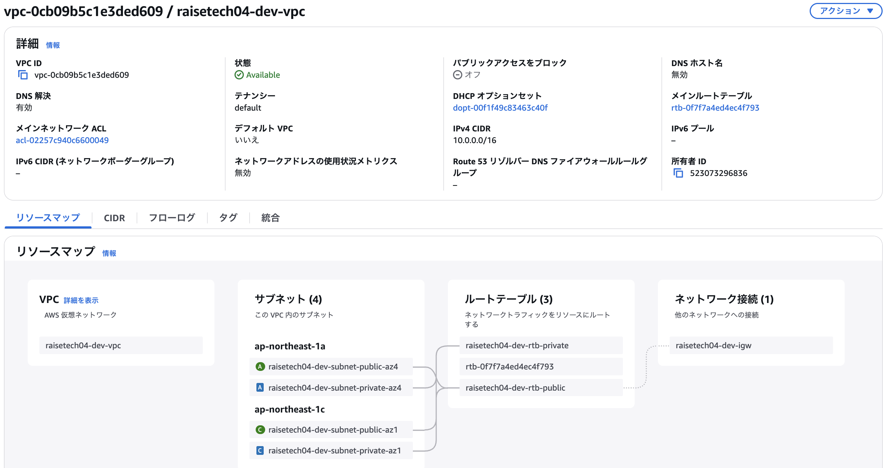
### 1-2.インターネットゲートウェイ
インターネットとの通信を可能にするため、VPCにアタッチ
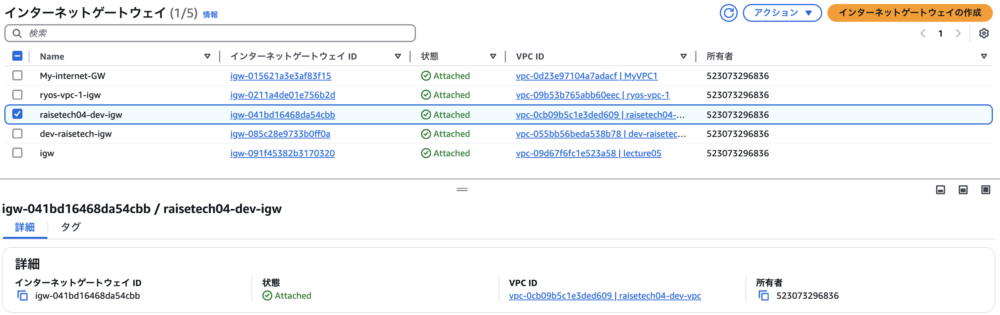
### 1-3.サブネット
2つのAZ(ap-northeast-1aとap-northeast-1c)にパブリックサブネットとプライベートサブネットを1つずつ作成
#### 1-3-1.パブリックサブネット  
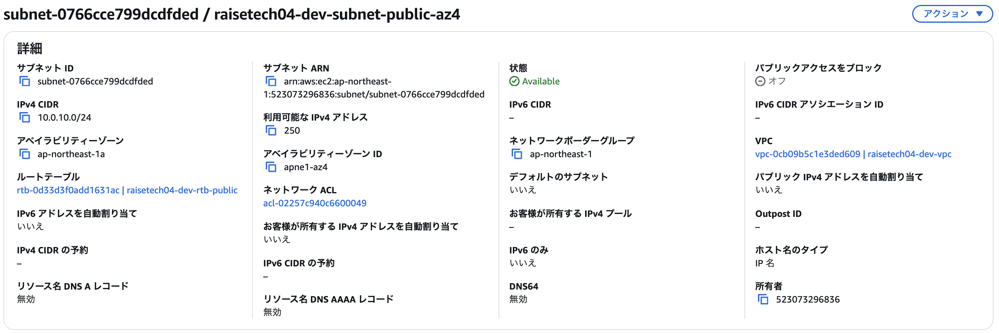

#### 1-3-2.プライベートサブネット
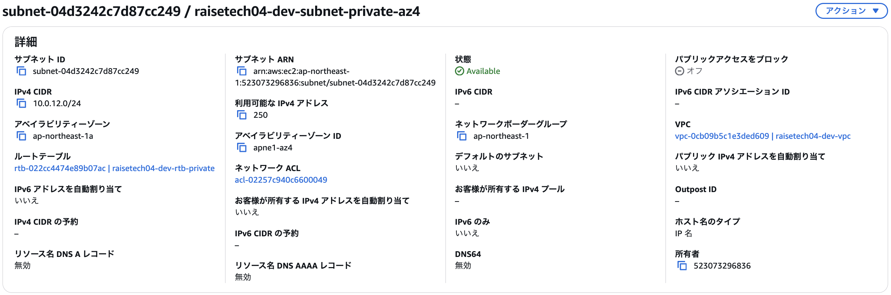
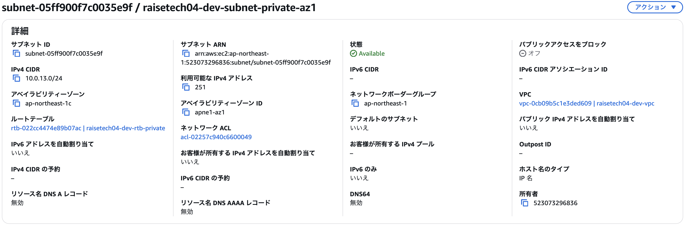
### 1-4.ルートテーブル
パブリックサブネット用とプライベートサブネット用のルートテーブルを作成し、1-3で作成した各サブネットにアタッチ
#### 1-4-1.パブリック用
0.0.0.0/0 の場合、インターネットゲートウェイにルーティングするように設定することで、外部への通信を可能にしている。
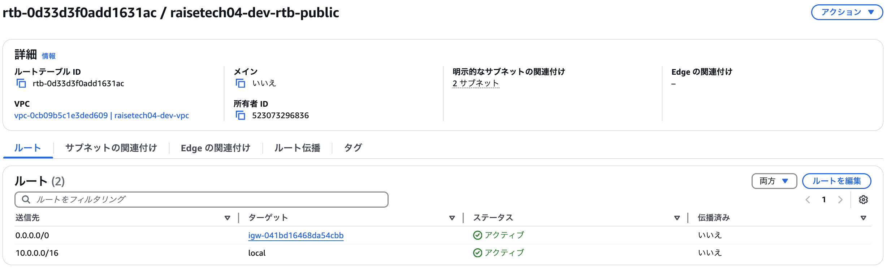
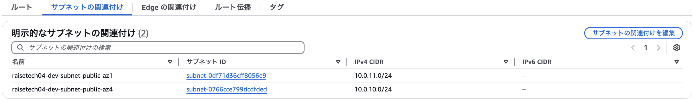
#### 1-4-2.プライベート用
VPC内のみ通信が可能
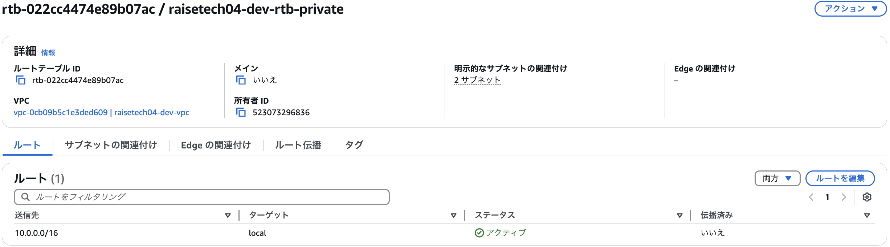
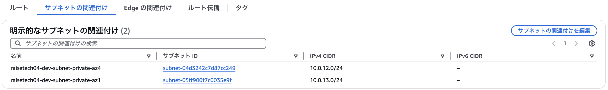
### 1-5.ネットワークACL
セキュリティグループでインスタンス単位で通信の制御を行うため、VPC作成時のメインネットワークACLをそのまま使用している。
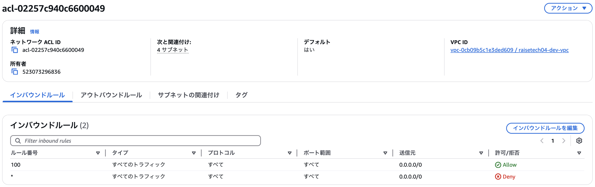
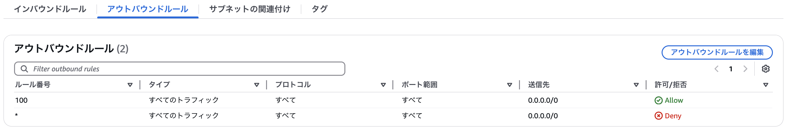
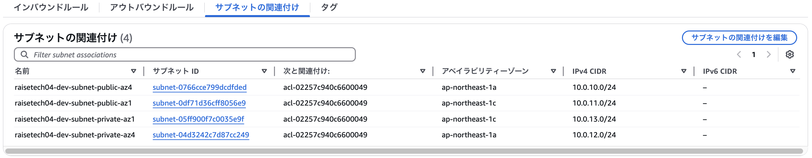


## 2.EC2の作成
### 2-1.EC2
インスタンスタイプは無料利用枠の t2.micro を利用  
APサーバの役割を想定して、パブリックサブネットに作成
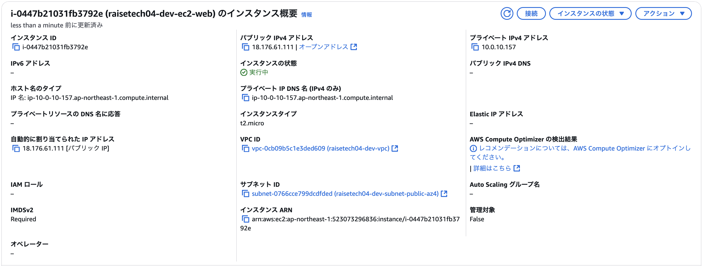
### 2-2.セキュリティグループ
全てのソースからの、SSH(ポート22)を利用した通信のみ許可するように制御を行っている。
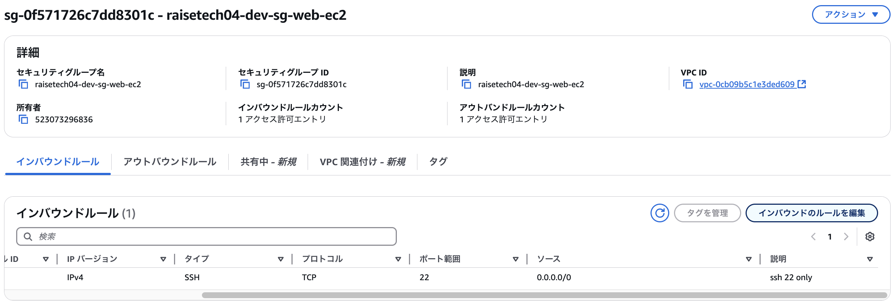
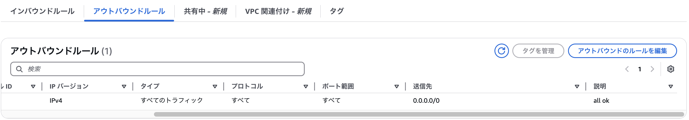

## 3.RDSの作成
### 3-1.RDS
DBエンジンは MySQL 8.0.40 を設定  
DBサーバの役割を想定して、プライベートサブネットに作成
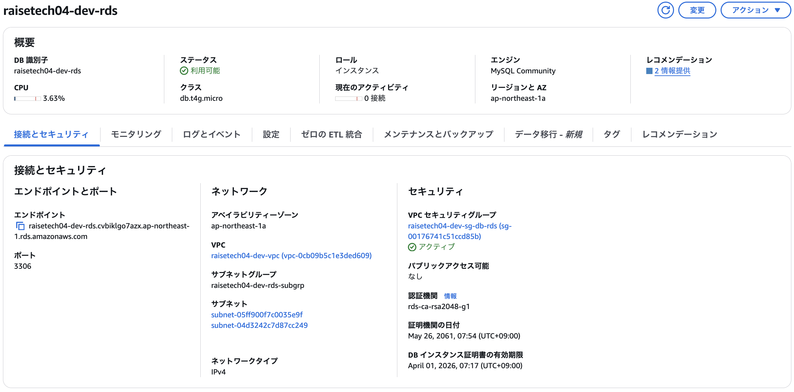
### 3-2.サブネットグループ
1で作成した2つのAZのプラベートサブネットを設定
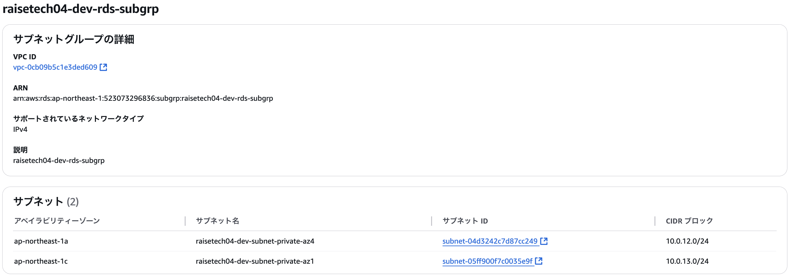
### 3-3.セキュリティグループ
2-1で作成したEC2用のセキュリティグループがアタッチされているインスタンスからの、ポート3306を利用した通信のみ許可するように制御を行なっている。
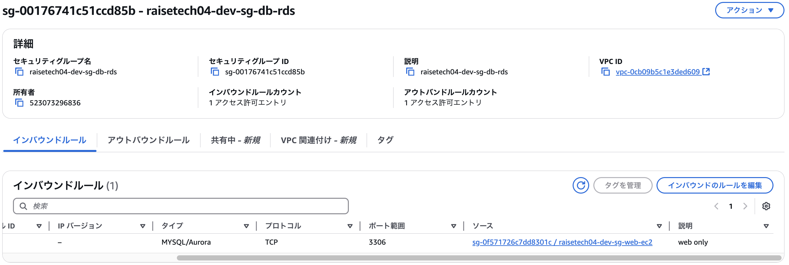
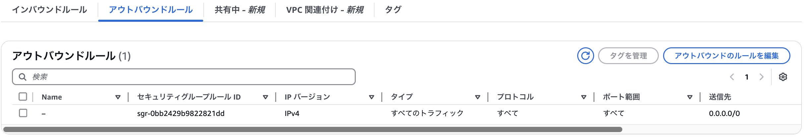

## 4.EC2→RDSへの疎通確認
クライアント端末からSSH接続でEC2に接続し、EC2上からRDSに接続することで疎通確認を行う。
### 4-1.SSHを用いた、クライアント端末→EC2の接続
キーペア秘密鍵を用いて、クライアント端末からEC2にSSH接続
```
$ ssh -i "raisetech.pem" ec2-user@18.176.61.111
Last login: Thu Apr 10 22:38:01 2025 from kd106133122254.au-net.ne.jp
   ,     #_
   ~\_  ####_        Amazon Linux 2
  ~~  \_#####\
  ~~     \###|       AL2 End of Life is 2026-06-30.
  ~~       \#/ ___
   ~~       V~' '->
    ~~~         /    A newer version of Amazon Linux is available!
      ~~._.   _/
         _/ _/       Amazon Linux 2023, GA and supported until 2028-03-15.
       _/m/'           https://aws.amazon.com/linux/amazon-linux-2023/

[ec2-user@ip-10-0-10-157 ~]$ 
```

### 4-2.EC2→RDSの接続
mysql-clientをインストールしたEC2からRDSに接続
```
[ec2-user@ip-10-0-10-157 ~]$ mysql -u admin -p -h raisetech04-dev-rds.cvbiklgo7azx.ap-northeast-1.rds.amazonaws.com
Enter password: 
Welcome to the MySQL monitor.  Commands end with ; or \g.
Your MySQL connection id is 648
Server version: 8.0.40 Source distribution

Copyright (c) 2000, 2025, Oracle and/or its affiliates.

Oracle is a registered trademark of Oracle Corporation and/or its
affiliates. Other names may be trademarks of their respective
owners.

Type 'help;' or '\h' for help. Type '\c' to clear the current input statement.

mysql> 
```

## 所感
本課題を通じて、EC2やRDSなど、AWSの主要サービスの作成方法についての理解が深まりました。  
また、VPCを作成する際には、ルートテーブルやサブネットといった関連するネットワークリソースを手動で構築することで、それぞれのリソースの役割や依存関係を把握することができました。これらのリソースは通常AWS側が自動で作成してくれるため、必ずしも手動で作る必要はありませんが、仕組みを正しく理解するという意味では役にたつと思いますので、今後の課題においても、必要に応じて取り組んでいきたいと思います。
